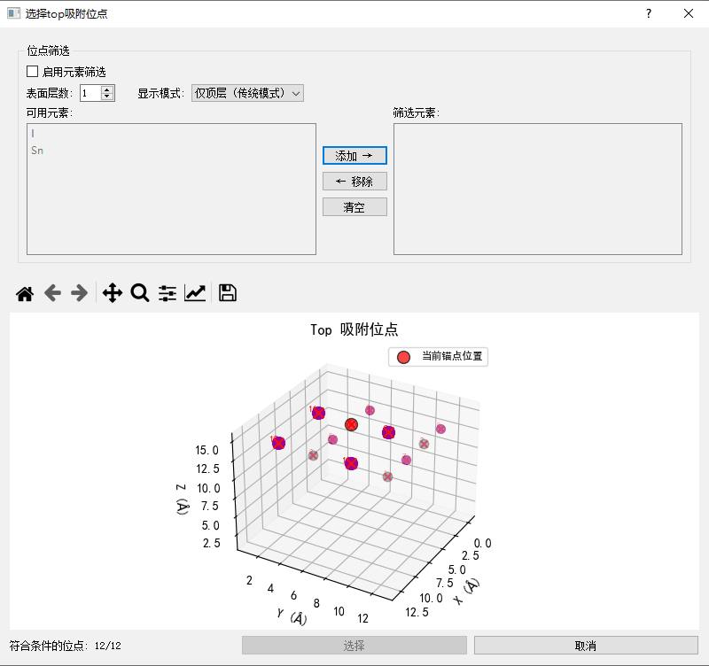
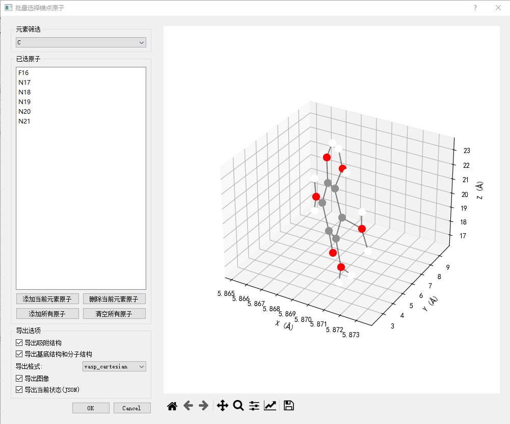
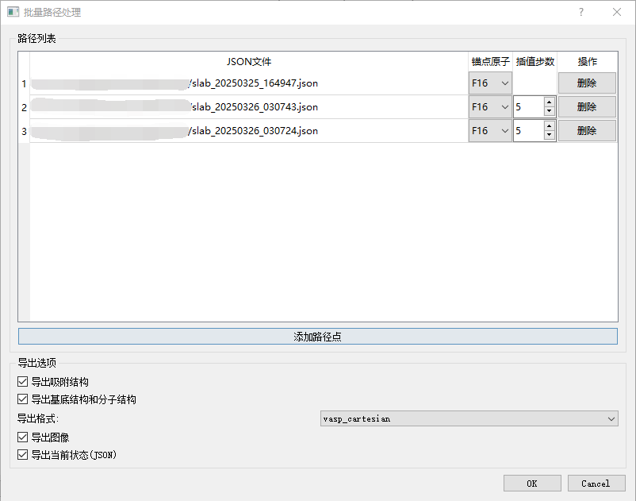

# 分子吸附系统构建工具

这是一个用于构建分子吸附系统的图形界面工具，支持多种吸附位点选择、锚点选择和路径插值功能。

## 快速开始

### 安装依赖
```bash
# 创建虚拟环境（推荐）
python -m venv venv
source venv/bin/activate  # Linux/Mac
# 或
venv\Scripts\activate  # Windows

# 安装依赖包
pip install -r requirements.txt
```

### 启动程序
```bash
# 进入程序目录
cd molecular_adsorption

# 启动图形界面
python adsorption_gui.py
```

## 功能特点

- 支持多种吸附位点选择方式：
  - 单个位点选择
  - 批量位点选择
  - 基于元素筛选的位点选择
- 支持多种锚点选择方式：
  - 单个锚点选择
  - 批量锚点选择
  - 基于元素筛选的锚点选择
- 支持路径插值功能：
  - 两点间路径插值
  - 批量路径处理
- 支持多种导出格式：
  - VASP (Cartesian/Fractional)
  - XYZ
  - CIF
  - XSF
- 支持导出多种内容：
  - 吸附结构
  - 基底结构
  - 分子结构
  - 3D视图
  - 投影视图
  - 状态文件(JSON)

## 输入格式支持

### 基底结构
- VASP (POSCAR)
- XYZ
- CIF
- XSF

### 分子结构
- VASP (POSCAR)
- XYZ
- CIF
- XSF

## 输出格式支持

### 结构文件
- VASP (Cartesian/Fractional)
- XYZ
- CIF
- XSF

### 图像文件
- PNG (3D视图)
- PNG (投影视图：XY、XZ、YZ平面)

### 状态文件
- JSON (包含所有配置参数)

## 界面说明

### 主界面


主界面包含以下主要功能区域：
1. 文件操作区：用于加载基底和分子结构
2. 参数调整区：用于调整吸附高度、角度等参数
3. 位点选择区：用于选择吸附位点
4. 锚点选择区：用于选择分子锚点
5. 3D显示区：实时显示结构
6. 操作按钮区：包含各种功能按钮

### 单个位点选择界面


单个位点选择界面提供以下功能：
1. 3D结构显示
2. 元素筛选
3. 表面原子筛选
4. 单个位点选择

### 单个锚点选择界面


单个锚点选择界面提供以下功能：
1. 分子3D显示
2. 元素筛选
3. 单个锚点选择

### 批量位点选择界面


批量位点选择界面提供以下功能：
1. 3D结构显示
2. 元素筛选
3. 表面原子筛选
4. 批量选择操作
5. 导出选项设置

### 批量锚点选择界面


批量锚点选择界面提供以下功能：
1. 分子3D显示
2. 元素筛选
3. 批量选择操作
4. 导出选项设置

### 路径插值界面


路径插值界面提供以下功能：
1. 路径点添加/删除
2. 插值步数设置
3. 导出选项设置

## 使用说明

### 基本操作流程

1. 加载基底结构
   - 点击"加载基底"按钮
   - 选择支持的格式文件（VASP、XYZ、CIF、XSF）

2. 加载分子结构
   - 点击"加载分子"按钮
   - 选择支持的格式文件（VASP、XYZ、CIF、XSF）
   - 或使用"从PubChem下载"功能下载分子

3. 选择吸附位点
   - 在基底上点击选择位点
   - 或使用批量选择功能
   - 可以使用元素筛选功能快速定位特定元素

4. 选择分子锚点
   - 在分子上点击选择锚点
   - 或使用批量选择功能
   - 可以使用元素筛选功能快速定位特定元素

5. 调整参数
   - 使用滑块调整高度（默认2.0Å）
   - 使用滑块调整角度（X、Y、Z三个方向）
   - 使用输入框调整偏移（X、Y方向）

6. 导出结果
   - 选择导出内容（吸附结构、基底结构、分子结构等）
   - 选择导出格式（VASP、XYZ、CIF、XSF）
   - 点击导出按钮

### 批量处理功能

1. 批量位点处理
   - 点击"批量位点"按钮
   - 在对话框中选择多个位点
   - 设置导出选项
   - 确认处理

2. 批量锚点处理
   - 点击"批量锚点"按钮
   - 在对话框中选择多个锚点
   - 设置导出选项
   - 确认处理

3. 路径插值处理
   - 点击"路径插值"按钮
   - 添加多个路径点
   - 设置插值步数
   - 设置导出选项
   - 确认处理

## 输出文件说明

### 结构文件
- `combine-*.{format}`: 完整的吸附系统结构
- `slab-*.{format}`: 基底结构
- `molecule-*.{format}`: 分子结构

### 图像文件
- `*_3d.png`: 3D视图
- `*_xy_proj.png`: XY平面投影
- `*_xz_proj.png`: XZ平面投影
- `*_yz_proj.png`: YZ平面投影

### 状态文件
- `*_state.json`: 包含所有配置参数的状态文件

## 注意事项

1. 文件格式
   - 确保输入文件格式正确
   - 检查文件编码（推荐UTF-8）
   - VASP文件需要包含原子坐标和晶格信息

2. 结构要求
   - 基底结构需要是周期性结构
   - 分子结构需要是完整的分子
   - 确保分子结构中的原子坐标合理

3. 参数设置
   - 吸附高度建议在合理范围内（1.5-3.0Å）
   - 角度调整时注意分子方向
   - 真空层高度建议大于10Å

4. 批量处理
   - 建议先测试单个结构
   - 批量处理时注意文件命名
   - 确保有足够的磁盘空间

## 常见问题

1. 结构显示问题
   - 检查文件格式是否正确
   - 检查结构是否完整
   - 检查原子坐标是否合理

2. 导出失败
   - 检查文件权限
   - 检查磁盘空间
   - 检查文件命名（避免特殊字符）

3. 批量处理失败
   - 检查选择是否有效
   - 检查参数是否合理
   - 检查输出目录是否存在

## 依赖包版本要求
- Python >= 3.7
- numpy >= 1.20.0
- ase >= 3.22.0
- pymatgen >= 2022.0.0
- pubchempy >= 1.0.4
- rdkit >= 2022.03.1
- scipy >= 1.8.0
- matplotlib >= 3.5.0
- PyQt5 >= 5.15.0

## 更新日志

### v0.1.0 (2024-03-xx)
- 初始版本发布
- 支持基本的分子吸附系统构建功能
- 支持多种吸附位点选择方式
- 支持多种导出格式
