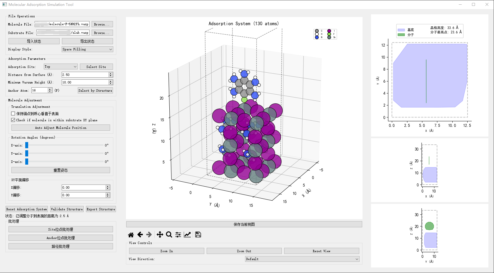
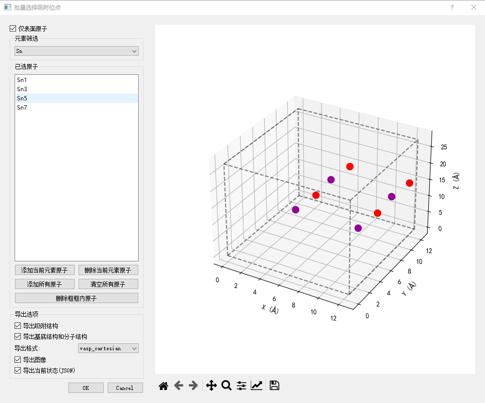
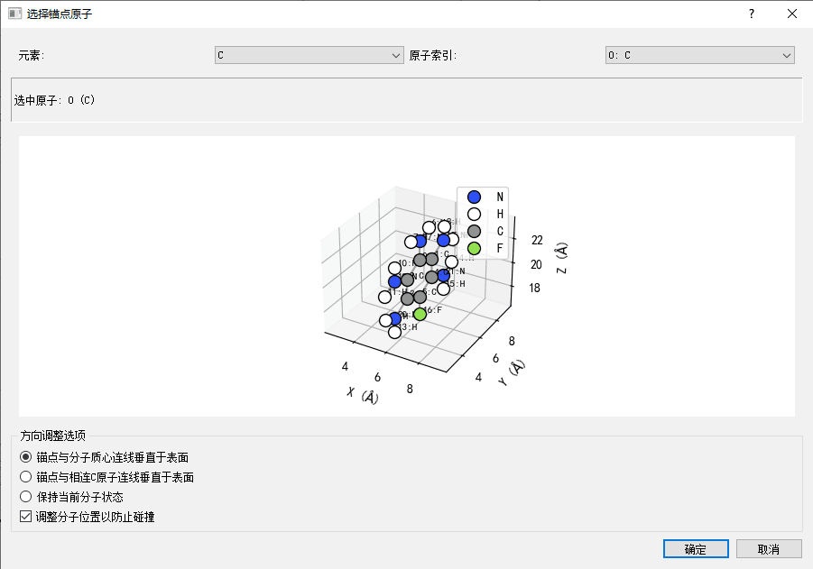

# 分子吸附模拟工具 (Molecular Adsorption Simulation Tool)

<div align="center">
    
</div>

English Version is avalaible here : 
[English Documentation](molecular_adsorption/README_EN.md

## 简介

这是一个用于模拟和可视化分子在表面吸附过程的图形界面工具。它允许用户导入基底和分子结构，选择吸附位点，调整吸附构型，并导出结果。该工具特别适用于催化、材料科学和表面化学等研究领域。

## 项目文件

本项目只包含以下文件和目录：

- `start.py` - 主启动文件（带语言选择）
- `simple_start_chn.py` - 中文版直接启动文件
- `simple_start_eng.py` - 英文版直接启动文件
- `molecular_adsorption/` - 主程序目录

**注意**: 项目目录中可能有其他文件，但它们与本工具无关。

## 安装

### 推荐python版本
- Python 3.9

### 安装步骤

1. 安装Python环境

```bash
python -m venv adsorption
.\adsorption\Scripts\Activate.ps1
```

3. 安装依赖包：

```bash
pip install -r requirements -i https://pypi.tuna.tsinghua.edu.cn/simple
```

## 使用方法

1. 运行启动器选择语言：

```bash
python start.py
```

2. 或直接运行特定语言版本：

```bash
# 中文版
python simple_start_chn.py

# 英文版
python simple_start_eng.py
```

**重要提示**: 请确保在项目根目录下运行上述命令，而不是在`molecular_adsorption`子目录中运行。这样可以确保所有输出文件都保存在正确的位置。

## 主要功能

- **导入结构文件**：支持多种格式的基底和分子结构导入
- **吸附位点选择**：顶位、桥位、空位等多种吸附位点类型
- **锚点选择**：灵活选择分子上的锚点原子
- **构型调整**：可旋转、平移分子位置，调整分子朝向
- **批量处理**：支持批量位点、批量锚点和路径插值等高级功能
- **导出功能**：可导出结构文件、图像和状态文件
- **多语言支持**：提供中文和英文界面

<div align="center">
    
    
</div>

## 详细文档

更详细的使用说明和文档，请参阅：

- [中文使用手册](molecular_adsorption/README_CN.md)
- [English Documentation](molecular_adsorption/README_EN.md)

## 工作流程

1. 加载基底结构
2. 加载分子结构
3. 选择吸附位点类型（顶位/桥位/空位）
4. 选择具体吸附位点
5. 选择分子锚点原子
6. 调整吸附距离、旋转角度和偏移量
7. 导出结构和图像

## 输出文件

程序将在`Adsorption_Results`目录下创建输出文件，包括：

- 结构文件（VASP、XYZ、CIF、XSF等格式）
- 图像文件（3D视图和投影视图）
- 状态文件（JSON格式，可用于恢复配置）

## 注意事项

- 请确保基底结构具有完整的周期性边界条件
- 分子锚点选择会影响最终吸附构型
- 批量处理前建议先测试单个构型
- 所有输出文件默认保存在项目根目录的`Adsorption_Results`文件夹中

## 许可

本软件仅用于学术研究和教育目的。

## 联系方式

如有问题或建议，请通过GitHub Issues或Pull Requests提交。 
