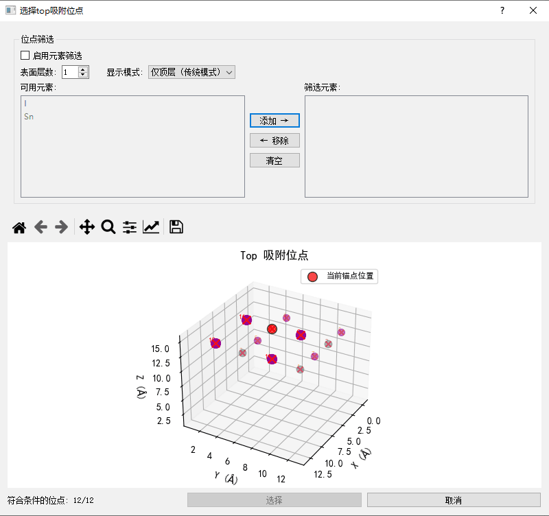
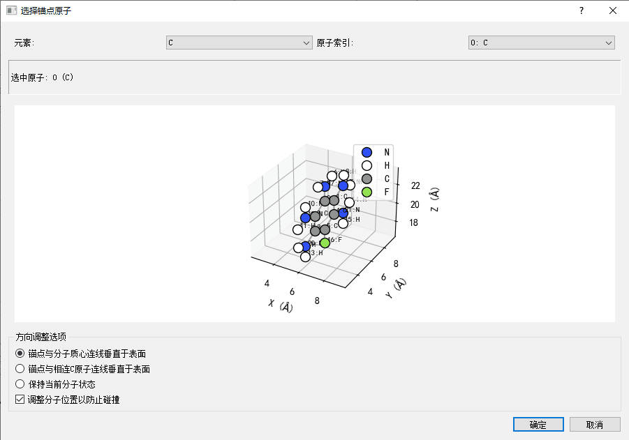
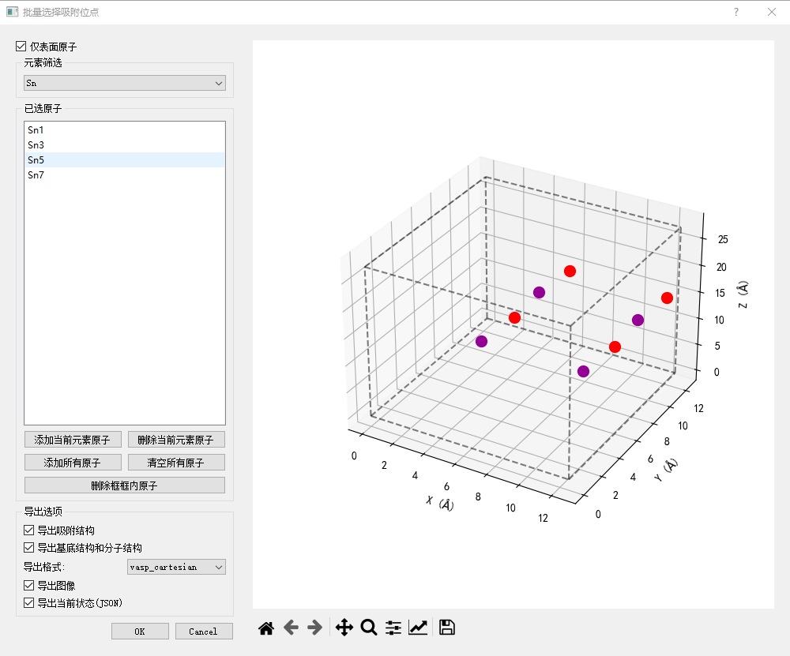
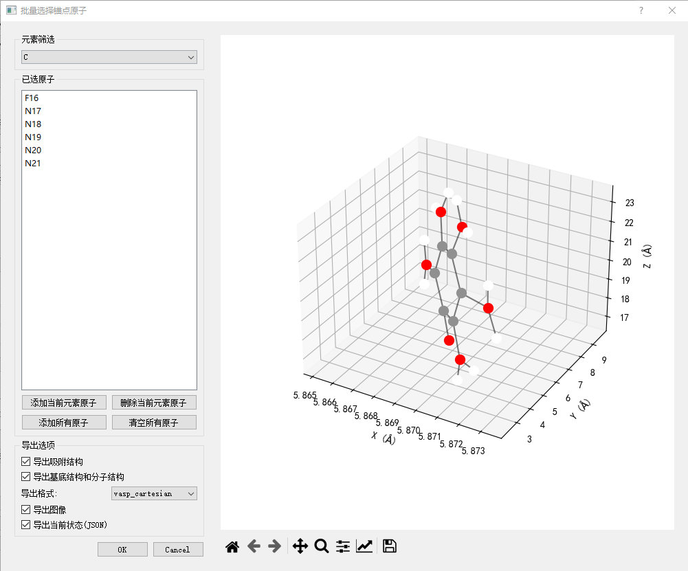

# Molecular Adsorption System Construction Tool

This is a graphical interface tool for constructing molecular adsorption systems, supporting various adsorption site selection, anchor point selection, and path interpolation functions.

## Quick Start

### Install Dependencies
```bash
# Create virtual environment (recommended)
python -m venv venv
source venv/bin/activate  # Linux/Mac
# or
venv\Scripts\activate  # Windows

# Install dependencies
pip install -r requirements.txt
```

### Launch Program

1.
```bash
python start.py
```

2.
```bash
# Enter program directory
cd molecular_adsorption

# Start GUI
python adsorption_gui.py
```

## Features

- Multiple adsorption site selection methods:
  - Single site selection
  - Batch site selection
  - Element-based site filtering
- Multiple anchor point selection methods:
  - Single anchor selection
  - Batch anchor selection
  - Element-based anchor filtering
- Path interpolation:
  - Two-point path interpolation
  - Batch path processing
- Multiple export formats:
  - VASP (Cartesian/Fractional)
  - XYZ
  - CIF
  - XSF
- Multiple export content types:
  - Adsorption structure
  - Substrate structure
  - Molecule structure
  - 3D view
  - Projection view
  - State file (JSON)

## Input Format Support

### Substrate Structure
- VASP (POSCAR)
- XYZ
- CIF
- XSF

### Molecule Structure
- VASP (POSCAR)
- XYZ
- CIF
- XSF

## Output Format Support

### Structure Files
- VASP (Cartesian/Fractional)
- XYZ
- CIF
- XSF

### Image Files
- PNG (3D view)
- PNG (Projection views: XY, XZ, YZ planes)

### State Files
- JSON (contains all configuration parameters)

## Interface Description

### Main Interface


The main interface contains the following functional areas:
1. File Operation: For loading substrate and molecule structures
2. Parameter Adjustment: For adjusting adsorption height, angles, etc.
3. Site Selection: For selecting adsorption sites
4. Anchor Selection: For selecting molecule anchor points
5. 3D Display: Real-time structure visualization
6. Operation Buttons: Various function buttons

### Single Site Selection Interface


The single site selection interface provides:
1. 3D structure display
2. Element filtering
3. Surface atom filtering
4. Single site selection

### Single Anchor Selection Interface


The single anchor selection interface provides:
1. Molecule 3D display
2. Element filtering
3. Single anchor selection

### Batch Site Selection Interface


The batch site selection interface provides:
1. 3D structure display
2. Element filtering
3. Surface atom filtering
4. Batch selection operations
5. Export options

### Batch Anchor Selection Interface


The batch anchor selection interface provides:
1. Molecule 3D display
2. Element filtering
3. Batch selection operations
4. Export options

### Path Interpolation Interface


The path interpolation interface provides:
1. Path point addition/removal
2. Interpolation step settings
3. Export options

## Usage Instructions

### Basic Workflow

1. Load substrate structure
   - Click "Load Substrate" button
   - Select a supported format file (VASP, XYZ, CIF, XSF)

2. Load molecule structure
   - Click "Load Molecule" button
   - Select a supported format file (VASP, XYZ, CIF, XSF)
   - Or use the "Download from PubChem" function

3. Select adsorption site
   - Click on the substrate to select a site
   - Or use the batch selection function
   - Use element filtering to quickly locate specific elements

4. Select molecule anchor point
   - Click on the molecule to select an anchor point
   - Or use the batch selection function
   - Use element filtering to quickly locate specific elements

5. Adjust parameters
   - Use sliders to adjust height (default 2.0Å)
   - Use sliders to adjust angles (X, Y, Z directions)
   - Use input fields to adjust offsets (X, Y directions)

6. Export results
   - Select export content (adsorption structure, substrate structure, molecule structure, etc.)
   - Select export format (VASP, XYZ, CIF, XSF)
   - Click export button

### Batch Processing Functions

1. Batch site processing
   - Click "Batch Site" button
   - Select multiple sites in the dialog
   - Set export options
   - Confirm processing

2. Batch anchor processing
   - Click "Batch Anchor" button
   - Select multiple anchors in the dialog
   - Set export options
   - Confirm processing

3. Path interpolation processing
   - Click "Path Interpolation" button
   - Add multiple path points
   - Set interpolation steps
   - Set export options
   - Confirm processing

## Output File Description

### Structure Files
- `combine-*.{format}`: Complete adsorption system structure
- `slab-*.{format}`: Substrate structure
- `molecule-*.{format}`: Molecule structure

### Image Files
- `*_3d.png`: 3D view
- `*_xy_proj.png`: XY plane projection
- `*_xz_proj.png`: XZ plane projection
- `*_yz_proj.png`: YZ plane projection

### State Files
- `*_state.json`: State file containing all configuration parameters

## Important Notes

1. File formats
   - Ensure input files are in the correct format
   - Check file encoding (UTF-8 recommended)
   - VASP files should include atom coordinates and lattice information

2. Structure requirements
   - Substrate structure should be periodic
   - Molecule structure should be complete
   - Ensure atom coordinates in the molecule structure are reasonable

3. Parameter settings
   - Recommended adsorption height is within a reasonable range (1.5-3.0Å)
   - Pay attention to molecule orientation when adjusting angles
   - Recommended vacuum layer height is greater than 10Å

4. Batch processing
   - Test with a single structure first
   - Pay attention to file naming during batch processing
   - Ensure sufficient disk space

## Common Issues

1. Structure display issues
   - Check if the file format is correct
   - Check if the structure is complete
   - Check if atom coordinates are reasonable

2. Export failures
   - Check file permissions
   - Check disk space
   - Check file naming (avoid special characters)

3. Batch processing failures
   - Check if selections are valid
   - Check if parameters are reasonable
   - Check if output directory exists

## Dependency Version Requirements
- Python >= 3.7
- numpy >= 1.20.0
- ase >= 3.22.0
- pymatgen >= 2022.0.0
- pubchempy >= 1.0.4
- rdkit >= 2022.03.1
- scipy >= 1.8.0
- matplotlib >= 3.5.0
- PyQt5 >= 5.15.0

## Changelog

### v0.1.0 (2024-03-xx)
- Initial version release
- Support for basic molecular adsorption system construction
- Support for multiple adsorption site selection methods
- Support for multiple export formats
